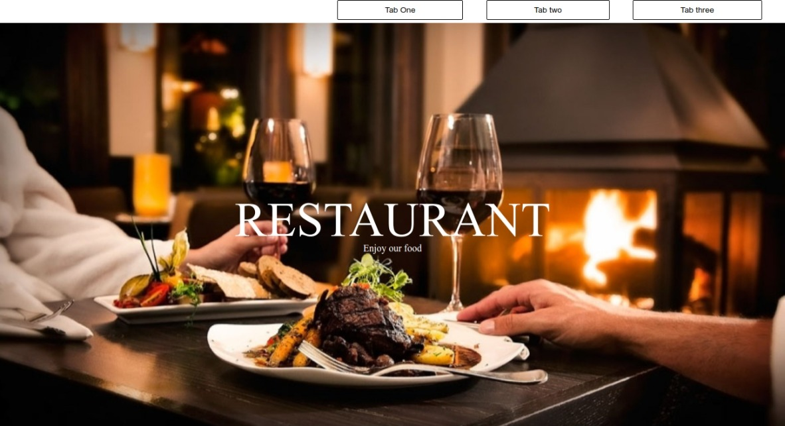
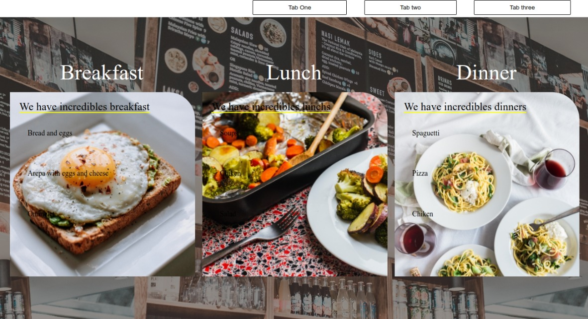

## Restaurant page
For this project I create a restaurante page using JavaScript and webpack, you will able to see a home page, with a message, a menu tab with the different mennu options, and a contact tab where you can see info for contact proposse.

</br>


# Live demo
[visit page](https://rawcdn.githack.com/gasb150/restaurant/1fbe06802913a3693f4fe53dd6e9d588bda99896/dist/index.html)

# Built With

- JavaScript
- HTML
- Webpack
- CSS


# How to start the project from your Local enviroment
1. Open your terminal where you want to store the project
2. To clone the repository:
run the next command
```
git clone https://github.com/gasb150/restaurant.git
```
And change directory to point to the restaurant dir.
Now run:
```
npm install
```
And now:
```
npm start
```
Move to the folder and select index.html, now Open the live server.


# Authors
👤 **Gustavo Sanmartin** :bird:

- GitHub: [@gasb150](https://github.com/gasb150)
- Twitter: [@7aves](https://twitter.com/7aves)
- LinkedIn: [Gustavo Sanmartin](https://www.linkedin.com/in/gustavsanmartin/)

## 🤝 Contributing

Contributions, issues, and feature requests are welcome!

Feel free to check the [issues page](https://github.com/gasb150/restaurant/issues/1).

## Show your support

Give a ⭐️ if you like this project!

### Acknowledgements

- Microverse
- The Odin Project


## 📝 License

This project is [MIT](./LICENSE) licensed.